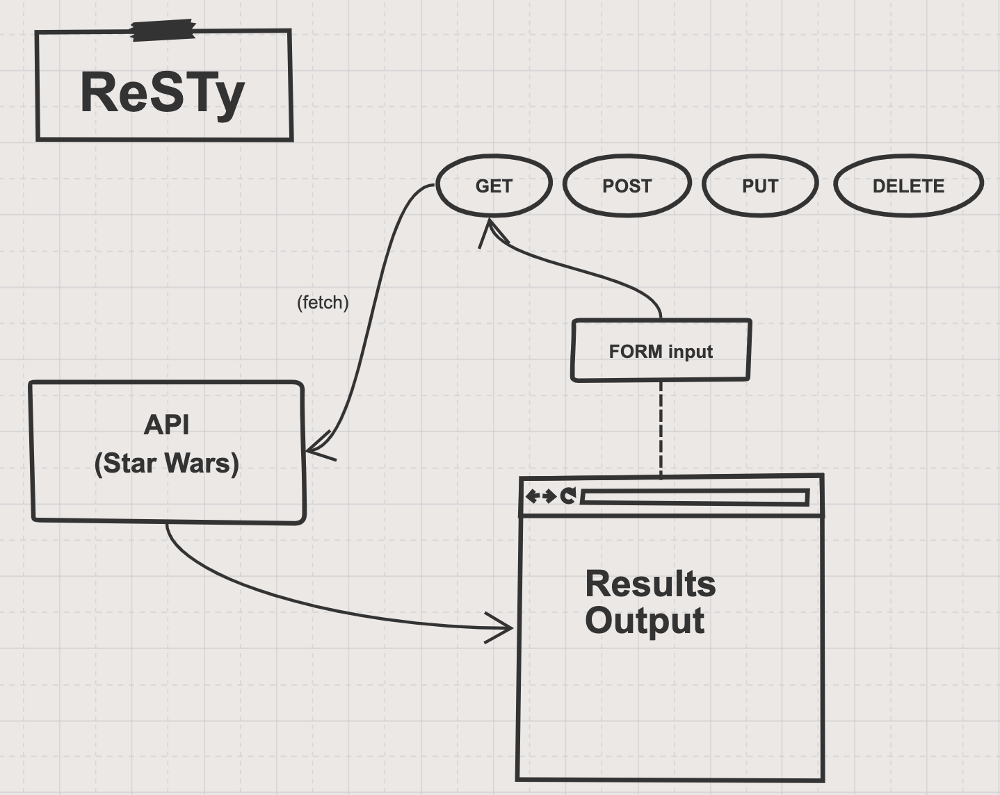

# resty
Browser-based, RESTful API testing tool.

## Version
0.2.0

## Auther
- Tia Low

### About
Full-stack JavaScript developer with a diverse background of personal and professional experience.
- [Linkedin](https://www.linkedin.com/in/tia-low/)

## Collaborations and Resources
- Alex Whan: [GitHub](https://github.com/alex-whan)

## Description
### **Phase 1: Application Setup**
- Basic React Application
- Scaffolding
- Basic State
- Rendering

### **Phase 2: Testing and Deployment**
- Testing of React components and applications
- Uses best practices for testing Behaviors and Acceptance Criteria

### **Phase 3: State and Props**
- Deploy to GitHub Pages
- Create multiple components to handle each aspect of the Application
- Sharing state and behaviors between components
- Basic layout and styling

### **Phase 4: Fit and Finish**
- Incorporate the spinner, using conditional rendering
- App is Fully Tested
- App is Fully Documented
- RESTy is Deployed and publicly available

## UML

